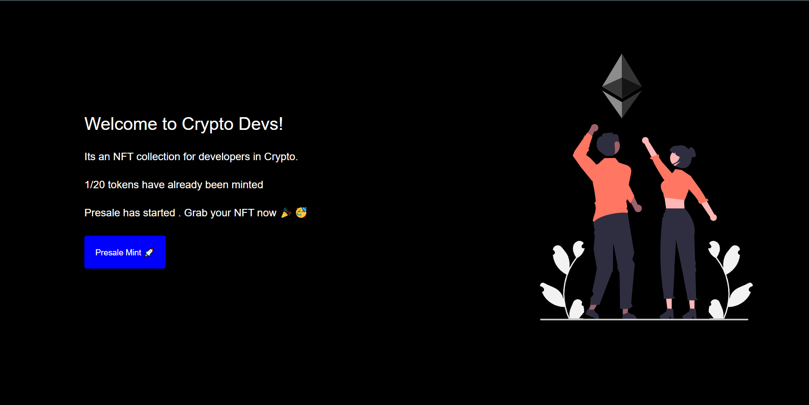

# NFT-Marketplace

This is a good Dapp that exhibits as next level dealing with eth blockchain
###  Concepts Involved

    - NextJs
            Api Routing
            CSS Modules
            Use Hooks
            State management
            Conditional Rendering
            Async functions
            Timed Functions
      
    - Ethers.js
            Provider
            Signer
            Utils
            call transactions
      
    - Web3Modal
            Metamask Connection
            Web3Modal Provider

    - Solidity    
            OpenZeppelin
            ERC721 Emuerable 
            Ownable
            Custom Smart contracts 
            Receiving Ether
            Mapping
            Payable Function
            Pure Function
            View Functions

    

It illustrates how you can build a part of your marketplace

### Types of Users
  
  - Owner - who has deployed the contract
  - Whitelisted User
      - Who are whitelisted before the sale of NFTs begin
          - can take part in presale minting ( 5 minutes before public minting)
  - Non-Whitelisted User
      - A User that has not whitelisted
          - Can do Public Mint
         
         
##### Total Supply
    Total token supply is 20 CryptoDev Tokens
    

### Usage

Here's how the flow Take place

    - A user comes to the site
    - Login Via Metamask
    - Mint
      - Presale Mint - if presale has started
      - Public Mint  -  If presale has ended

#### Deployment Network
    Ethereum Rinkeby
    
### Deployment Link    

[Click Here to visit Website](https://nft-marketplace-umaresso.vercel.app/)
    
    
